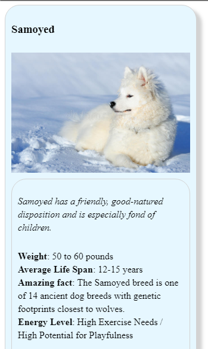
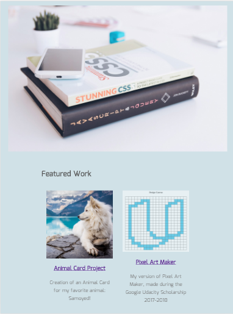
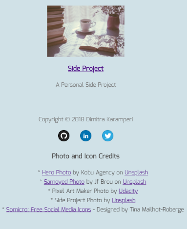
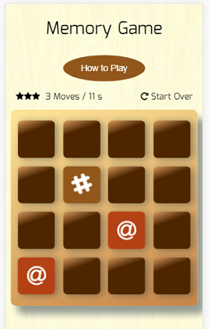
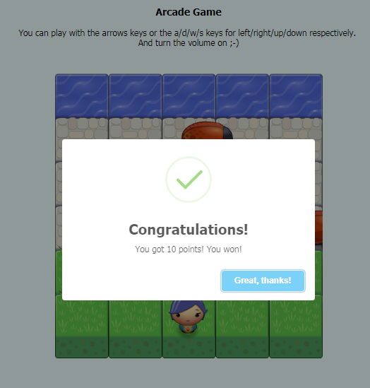
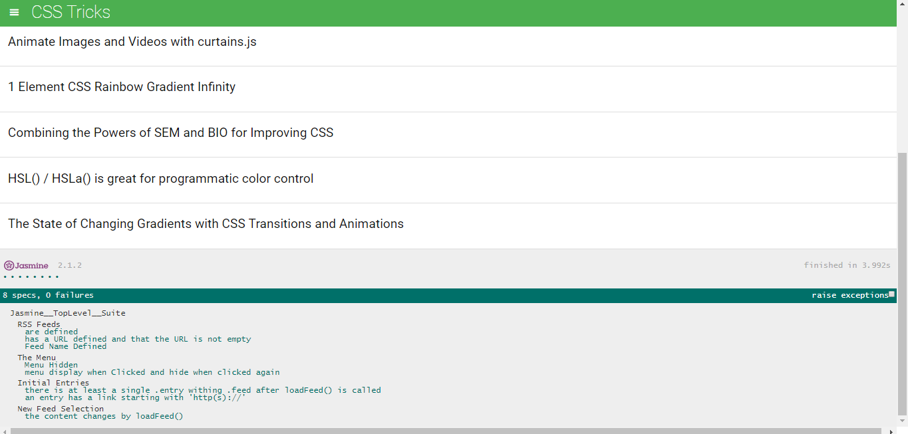
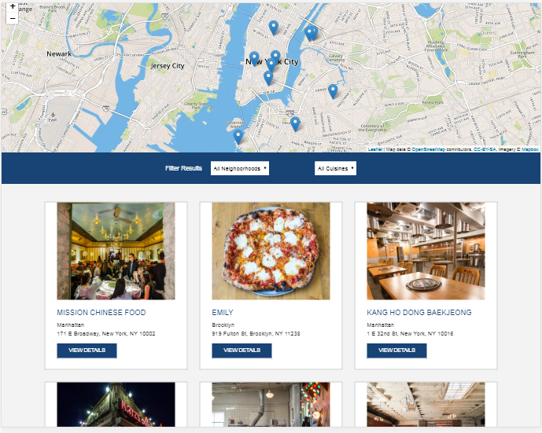

# **Front-End Development Nanodegree (Udacity, 2018)**
A repository for the projects that I have done/will do during my Udacity **Front-End Development Nanodegree** (full **Google Scholarship 2018**).

## **Project 1:** <a href="https://codepen.io/dimitraK/full/rprEzy/" target="_blank">Animal Trade Card</a>

An **exercise** to use what I have learned about **CSS** to **convert** a design prototype into a functional webpage.

GitHub repository: <a href="https://github.com/dimikara/nanodegree-project1-animal-trade-card" target="_blank">https://github.com/dimikara/nanodegree-project1-animal-trade-card</a>

___

## **Project 2:** <a href="https://dimikara.github.io/My-Portfolio/" target="_blank">My Portfolio</a>

For this project, I built a **responsive portfolio website** that will display images, descriptions and links to portfolio projects.

GitHub repository: <a href="https://github.com/dimikara/My-Portfolio" target="_blank">https://github.com/dimikara/My-Portfolio</a>

___

## **Project 3:** <a href="https://dimikara.github.io/Memory-Game/" target="_blank">Memory Game</a>

The objective of this project was to build a version of the classic memory game 'Concentration', using **JavaScript**, **DOM selectors** and **Event Listeners**.

GitHub repository: <a href="https://github.com/dimikara/Memory-Game" target="_blank">https://github.com/dimikara/Memory-Game</a>

___

## **Project 4:** <a href="https://dimikara.github.io/Arcade-Game/" target="_blank">Arcade Game</a>

I was provided with visual assets and a game loop engine; using these tools I added a number of entities to the game including the player characters and enemies to recreate a version of the classic arcade game Frogger. 

I learnt JavaScript’s **Object Oriented Programming** features to write eloquently designed **classes** capable of creating **countless instances** of similarly functioning **objects**.

GitHub repository: <a href="https://github.com/dimikara/Arcade-Game" target="_blank">https://github.com/dimikara/Arcade-Game</a>

___

## **Project 5:** Feed Reader Testing

An exercise on writing tests with Jasmine framework.

GitHub repository: <a href="https://github.com/dimikara/frontend-nanodegree-feedreader" target="_blank">https://github.com/dimikara/frontend-nanodegree-feedreader</a>

___

## **Project 6:**  Restaurant Reviews App — Stage 1

How a static webpage is converted to a **mobile-ready** & **accessible** web application, that can work **offline** with the help of a **Service Worker**.

GitHub repository: <a href="https://github.com/dimikara/Restaurant-Reviews-App-Stage-1" target="_blank">https://github.com/dimikara/Restaurant-Reviews-App-Stage-1</a>

___

## **Project 7:** MyReads: A Book Tracking App

To be added
___

## **Project 8:** Neighborhood Map (React)

To be added
___

